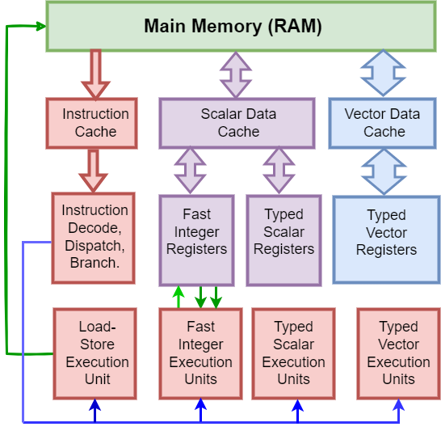
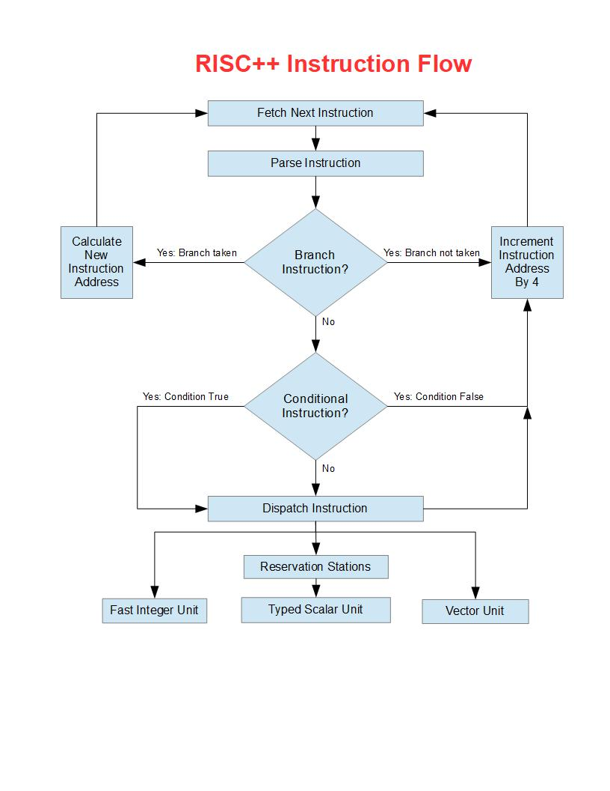

# What is the RISC++ Architecture?

The RISC++ Architecture began as a hobby in which I was trying to define a binary machine code and the associated Assembler language which would have a close "semantic fit" with the C++ language. From the very beginning, RISC++ had the concept that the data type of an operation was to be defined by the *registers* rather than the *instructions*. Then the RISC++ instructions would apply to a variety of data types and combinations of types. This has never changed. Unlike most Instruction Set Architectures (ISAs), a single ADD instruction applies to various data types like *float*, *double* and *int*. This is facilitated by **Type/Status Registers (TSRs)** which will be explained shortly.

Another constant in RISC++ has been the use of *conditional instructions* which are either executed or skipped depending if previously set *condition bits* are either true or false. Not only are the BRANCH instructions conditional, but so are instructions like ADD, SUBTRACT, MULTIPLY and DIVIDE. This means that many branches can be eliminated from the instruction stream thus streamlining the binary code. Branches and branch prediction have always been a challenge for hardware designers. It is my belief that the RISC++ methodology will both simplify and accelerate the machine code.

A recent innovation in RISC++ is the introduction of *variable length typed Vectors*. The RISC++ vector instructions, like the the Scalar counterparts, use generic instructions such as VECTOR ADD, VECTOR MULTIPLY. The data type is associated with the Vector data in a **Type/Status/Length Registers (TSLRs)**. 

Tightly coupled to the Vector instructions and typed data is the concept of the **Typed Pointer (TPTR)**. Typed Pointers carry the data type and length in the upper 16 bits of a 64-bit register while the lower 48 bits carry the memory address of the data. Typed pointers are similar to *reference variables* in C++ and are very important in Vector operations.

This chapter will introduce the main features of the RISC++ architecture, while later chapters will supply greater detail.

## Hybrid Architecture for Scalar and Vector Operations.

RISC++ is a hybrid architecture designed to enable fast execution of serial instruction streams which include both scalar and vector data. It incorporates the features of both [Central Processing Units (CPU)](https://en.wikipedia.org/wiki/Central_processing_unit) and [General-purpose computing on graphics processing units (GPGPU)](https://en.wikipedia.org/wiki/General-purpose_computing_on_graphics_processing_units). RISC++ is not meant to replace various CPUs, such as the Intel [X86](https://en.wikipedia.org/wiki/X86) family of processors, but to coexist with them.

When I speak of the X86 I am referring to a whole family of processors that began with the original Intel® 8086™ and have grown and and expanded over the years. The X86 Architecture has evolved from 16 bits to 64 bits. The X86 ISA has been implemented on many chips designed by various companies such as Intel®, AMD®, IBM® and many others. There is no need to compete with or replace either the X86 ISA or the chips that implement it. Instead the RISC++ is intended to be a coprocessor that can offload computation heavy workloads. 

Because of the support for 256 byte long vectors, a RISC++ core would be larger than today's X86 cores. But a single core would be considerably smaller than a GPU. Since the RISC++ cores are relatively small by today's standards, several (2, 4, 8) of them can be put on a single chip. This would make a really nice laptop for a scientist who needs fast computing in the field. 

Today's existing math libraries already manage many parallel threads of operation each working on a part of the problem. These are solutions that have been well developed and are already supported by various [C++](https://en.wikipedia.org/wiki/C%2B%2B) code libraries. Since RISC++ binary code will have a one to one correspondence to many C++ operations, those libraries can be recompiled into code with a smaller foot print, and faster path lengths. 

Once a new compiler is written to target the RISC++ architecture, these libraries should be able to be ported quite easily. Since much of Linux is written in C++, it should also port easily. The Assembler portions of a RISC++ based Linux should also be intuitive with good control over the machine code. 

## Coprocessor Optimized for Scientific Programming

The decision to introduce a new architecture should never be taken lightly. Many well designed and well-financed processors have failed in the marketplace. Meanwhile, legacy architectures like the X86 continue to dominate. The reason is simple. Software development is costly. Hardware that can run legacy software without recompilation will always be very popular especially in the PC market. 

Furthermore, ramping up production of new chips is extremely expensive. The PC market has no need to move away from the dominance of Microsoft Windows and/or the X86 Architecture. Even people who prefer Linux based PCs and Laptops have great X86 based hardware to run it on with all the integrated graphics. RISC++ isn't for phones or anything that needs an integrated graphics processor. RISC++ is designed to coexist as a scientific coprocessor, rather than to replace X86. 

The RISC++ chip is designed to enhance scientific programming in a variety of environments:

1. As a coprocessor on the same motherboard as an X86 chip.
2. As a standalone computer running an Operating System like Linux.
3. As a processor mounted in a tower, on a PCI card.
4. As a computer “blade” mounted in a supercomputer system.
5. As a processor in a high-performance gaming machine with a Graphics Coprocessor.
6. As a high performance laptop computer designed for scientists working in the field.

RISC++ may be used in standalone applications that do not require X86 compatibility, such as Linux, or other Operating System environments. These would probably be running in Console mode since that is still very popular in many Linux server environments. If high-resolution graphics are required the system may need a dedicated graphics processor which are readily available on PCI cards. A Linux based laptop could also be built with a RISC++ chip and a separate GPU chip. The space that is often devoted to high-speed graphics on modern X86 chips is devoted to scientific vector processing on a RISC++ chip. 

The niche for this architecture is the scientific computing community, though some business applications might benefit as well. RISC++ cannot replace GPGPU applications when it comes to extremely high performance parallel processing of very large data sets. Instead the architecture integrates vector instructions into the serial instruction generated by the compiler.  

X86 processors also do this in a limited way using [Single Instruction, Multiple Data (SIMD)](https://en.wikipedia.org/wiki/SIMD). The X86 SIMD instruction set has evolved over the years leaving us with a complex array of instructions for compiler writers to choose between. RISC++ starts over with a new set of *Vector instructions* which work well with the standard "for loop" which is found in so many computer languages. 

## RISC++ Core

The RISC++ hardware consists of several "cores" which can be mounted on a chip. Each core supplies the components necessary to run a "thread" of operation. A thread is a serial instruction stream consisting of both scalar and vector instructions. This serial stream of instructions is converted at run time into several parallel instructions. Each core interfaces to three memory caches:

### [Cache Memory](https://en.wikipedia.org/wiki/CPU_cache)
 
1. **Instruction Cache**
* Direct mapped read only cache with fixed length buffers.
* Connected to Instruction Control Unit (ICU)
* Feeds instructions to be decoded and dispatched.

2. **Scalar Data Cache**
* Set associated read/write cache with variable length data access.
* Connected to Fast Integer and Typed Scalar Units.
* Variable data length from 8 to 128 bits.

3. **Vector Data Cache**
* Direct mapped read/write cache with 256 byte buffers.
* Connected to Vector Execution Unit
* Variable data length from 1 to 256 bytes.

The instructions are dispatched to "Execution Units" where they perform specialized operations:
 
### Execution Units

1. **Instruction Control Unit (ICU):** 
* Fetches Instructions from fixed length Instruction Cache.
* Decodes and dispatches instructions to other Execution Units.
* Handles Branches, Interrupts and Conditional Instructions.
* Manages Out of Order Instruction Execution (OoOE).
* Instruction pointer defines next instruction to be executed.
    a. 16 x 64-bit Address Registers
    b. 32 x 16-bit Short Integer Registers.
    c. 64 x 8-bit Type Status Registers (TSR).
    d. 16 x 1-bit In Order Condition Bits.
    e. 16 x 1-bit Out of Order Condition Bits.

2. **Load/Store Unit (LSU):**
* Moves data back and forth between data caches and register banks.
* Reads and writes 8, 16, 32, 64 or 128 bits to/from FIU and TSU 
* Reads and writes 1 to 256 bytes to/from Typed Vector Unit (TVU).
* Saves and Restores various Register banks.
* Converts Data Types to/from memory format and register format.
* Manages PUSH and POP to various Stacks.

3. **Fast Integer Unit (FIU):**
* Used for pointers, control registers and index registers.
* Executes Integer data in a single cycle.
* 32 x 64-bit integer registers.
* Also accesses various registers in ICU.
* No multiply and divide or other multicycle instructions.

4. **Typed Scalar Unit (TSU):**
* Used for both Integer and Floating Point Data.
* 64 x 64-bit Data registers
* 128-bit data in two registers.
* Each register associated with an 8-bit (TSR) in ICU.
    a. 4-bit Data Type Codes.
    b. 4-bit Status Code.
* TSRs allow generic instructions which use all data types.
* TSU uses Out of Order Execution.

5. **Typed Vector Unit (TVU)**
* 16 x 16-bit Type/Status/Length Registers (TSLR)
    a. 4-bit Data Type Code.
    b. 4-bit Status Code.
    c. 8-bit Vector Length.
* 16 x 256-Byte Variable length Vectors:
* Each Vector is mapped to 16 x 128-bit parallel registers.
* Same data types as Typed Scalar Unit.
* Supports C++ standard string operations (8 or 16-bit).

The following figure illustrates the major processor components in the RISC++ “Core”. There may be several cores on a single chip. Main memory feeds data to one of three caches; the Instruction Cache, the Scalar Data Cache, and the Vector Data Cache. These Level 1 caches are shared between cores. Level 2 caches may also be implemented. The Instruction Cache feeds instructions to the Instruction Control Unit (ICU) from where they are decoded and dispatched. Each core processes both scalar and vector instructions and data in a single thread with a single memory image.

## RISC++ Conditional Instructions

Another way in which RISC++ code mimics the C++ language is with *conditional instructions*. These instructions allow "IF THEN ELSE" clauses to be encoded without BRANCH instructions. The *Condition Bits (CBs)* are set various COMPARE instructions. 

The Instruction Control Unit (ICU) examines the status of the condition bit then dispatches the instruction to an *Execution Unit (EU)* if the bit is true.  Otherwise the instruction is skipped and eliminated from the instruction stream. Condition bit number 0 is always 1 and if the condition bit field is 0, the instruction will be interpreted as unconditional.

There are two sets of 16 Condition Bits. One set is updated very quickly by the *Fast Integer Unit (FIU)*. The other set is updated by the *Typed Scalar Unit* which uses Out of Order Execution. This will be explained more later. 

There are six compare instructions which encode (==, !=, <, <=, >, >= ) instructions:

~~~~~~~~~~~~~~~~~~~
    1. CMPEQ     CB,   RX,   RY;    // Set CB if RX == RY
    2. CMPNE     CB,   RX,   RY;    // Set CB if RX != RY
    3. CMPLT     CB,   RX,   RY;    // Set CB if RX <  RY
    4. CMPLE     CB,   RX,   RY;    // Set CB if RX <= RY
    5. CMPGT     CB,   RX,   RY;    // Set CB if RX >  RY
    6. CMPGE     CB,   RX,   RY;    // Set CB if RX >= RY
~~~~~~~~~~~~~~~~~~~ 

If the condition bit is TRUE, the instruction is dispatched to an execution unit. If the condition bit is FALSE, the instruction is skipped in the ICU and eliminated from the instruction stream. The Condition Bits can be CB manipulated by CB logical instructions:

~~~~~~~~~~~~~~~~~~~
    1  CBAND     CB,   CBX,  CBY;    // CB = CBX && CBY, Logical AND
    2  CBOR      CB,   CBX,  CBY;    // CB = CBX || CBY, Logical OR
    3  CBNOT     CB,   CBX;          // CB = ! CBX,      Logical NOT
~~~~~~~~~~~~~~~~~~~ 

### Example 1 - Conditional Move

Consider the following C++ code:

~~~~~~~~
    1. int    a = 10;		
    2. int    b = 15;		
    3. int    c = 0;
    5. if a < b then c = a;
    6. if a > b then c = b;
~~~~~~~~

The resulting RISC++ assembler code would be:
      
~~~~~~~~
    1.  DM       a,      IS16 = 10;      // Define memory a
    2.  DM       b,      IS16 = 15;      // Define memory b  
    3.  DM       c,      IS16 = 0;       // Define memory c    
    4.  LD       R4,     IS16,    a;     // Load a into R4, flag as int      
    5.  LD       R5,     IS16,    b;     // Load b into R5, flag as int 
    6.  CMPLT    CB4,    R4,      R5;    // set CB4 if R4 < R5   
    7.  CMPGT    CB5,    R4,      R5;    // set CB5 if R4 > R5 
    8.  CMOV     R6,     R4,      CB4;   // if CB4 is true R6 = R4
    9.  CMOV     R6,     R5,      CB5;   // if CB5 is true R6 = R5
    10. ST       R6,     IS16,    c;     // store R6 into c
~~~~~~~~

## Dynamically Typed Scalar and Vector Operands

The reason RISC++ was invented was to make assembler code and the resulting machine code, very close semantically to the C++ language. This was done to simplify both the machine code generated and the underlying hardware. Dynamically typed registers are the very heart of RISC++ and the principle way in which C++ semantics are built into the Assembler and machine code. 

High level languages (including C++) first declare the data as a given type then have generic operators (like + - * / % ) that operate on all different data types. That is exactly what RISC++ does. For example, a single ADD instruction may use integer or floating point operands of various lengths. The compiler does not need to generate different machine language instructions for each data type. There just only one instruction ... ADD. The same is true for all the standard C++ operators. Furthermore, source operands of different types can be freely intermixed, in many cases, just as they are in C++. 

Vector operations use 16 bit *Type/Status/Length Registers (TSLR)* which define variable length typed vectors from 1 to 256 bytes in length. The vector "registers" (or buffers) are 256 bytes long as opposed to the Intel SSE family which uses 128 bit registers. 

Because they are variable length, they can be used for string operations. Like the Scalar Registers, they carry the data type, status and length in a 16 bit TSLR. These 256 byte registers are nowhere near the size of parallel data that can be processed in today's Graphics Processing Units. But for smaller vectors they are more powerful than X86 cores. 

| Register  | 4 bit  Field | 4 bit Field  | 8 Bit Field   |
| --------- | ------------ | ------------ | ------------- |
|  TSR      | Type code    | Status code  |               |
|  TSLR     | Type code    | Status code  | Vector Length |  

Here is a full list of [Operators in C and C++](https://en.wikipedia.org/wiki/Operators_in_C_and_C%2B%2B). Many of these have a one to one correspondence to RISC++ instructions. This will become evident in the Assembler examples to follow.

### RISC++ Data Types

RISC++ defines the following  4 bit data type codes:  

| Code      |  Symbol   | Description                               | Max Vector Size | 
| --------- | --------- | ------------------------------------------| --------------- |
| 0000      | SWI       | Software Interrupt                        | 256 Bytes       |
| 0001      | BCD       | 32 x 4 bit Binary Coded Decimal digits    | 16 x 128 bit    |
| 0010      | BYTE      | 16 x 8 bit String of Bytes (ASCII)        | 256 x 8  bit    |
| 0011      | DF128     | 128 bit IEEE 754 Floating Point Decimal   | 16 x 128 bit    |  
| --------- | --------- | ------------------------------------------| --------------- |
| 0100      | BF16      | 16  bit Binary Floating Point             | 128 x 16  bit   |
| 0101      | BF32      | 32  bit Binary Floating Point             | 64  x 32  bit   |
| 0110      | BF64      | 64  bit Binary Floating Point             | 32  x 64  bit   |
| 0111      | BF128     | 128 bit Binary Floating Point             | 16  x 128 bit   |  
| --------- | --------- | ------------------------------------------| --------------- |
| 0100      | IS16      | 16  bit Integer Signed                    | 128 x 16  bit   |
| 0101      | IS32      | 32  bit Integer Signed                    | 64  x 32  bit   |
| 0110      | IS64      | 64  bit Integer Signed                    | 32  x 64  bit   |
| 0111      | IS128     | 128 bit Integer Signed                    | 16  x 128 bit   |
| --------- | --------- | ------------------------------------------| --------------- |
| 0100      | IS16      | 16  bit Integer Unsigned                  | 128 x 16  bit   |
| 0101      | IS32      | 32  bit Integer Unsigned                  | 64  x 32  bit   |
| 0110      | IS64      | 64  bit Integer Unsigned                  | 32  x 64  bit   |
| 0111      | IS128     | 128 bit Integer Unsigned                  | 16  x 128       |
| --------- | --------- | ------------------------------------------| --------------- |

### Intermixing of Input Operands of Different Types

All of the typed registers are 64 bits long. Data is converted from the memory format to the register format during the LOAD. Then it is converted back to the memory format during the STORE. This is true for both integer and floating point data. 

When loading signed integer data, the sign bit is propagated to the upper bits in the target register. The TSR is then flagged with the data type from memory. Similarly, when loading unsigned integer data, the upper bits in the target register are filled with zeros. 

The two integer source operands may have different signs and lengths of data. The target register inherits the length of the larger input operand. For example, if the two source operands are IS16 and IS32, the target operand would be IS32. If both source operands are unsigned, the target will be unsigned. If one of the input operands is unsigned, and this other is signed, the target operand will be signed.

Typed data instructions may intermix integer data types of different lengths and signs without errors. The data will overflow and wrap according to the data type in the TSR. However, if an attempt is made to mix two input operands in which one is *integer* and the other is *floating point*, the status field of the target register will indicate a "Data Type Error". 

When we get to the section on interrupts I will expand on this further. To avoid flagging an error, the compiler or the Assembler programmer must insert a CONVERT instruction which will convert the integer operand into a floating point, and then issue the instruction.

When typed registers are to be used for floating point operations. the internal registers are in the BF64 format (C++ type double). When the memory location is BF16 (half float) or BF32 (float), the data is converted to the BF64 format during the load. The data type of the memory location is then flagged in the TSR for rounding and overflow purposes. Input operands of BF16, BF32 and BF64 can be freely intermixed. When a target register is written, it *inherits* the type of the input operand of higher precision.

128 bit scalars use two even/odd registers. **All loads of 128 bit data must specify an even register.** Input data operands of 128 bit length *must match* data types. The type field of the odd register is set to the 128 bit type and the status is set to 1111 (odd register). If an Assembler programmer forgets and references the odd register it will produce a data type error. Presumably the compiler should know better.

### Example 2 - Intermixing *float* and *double* operands:

Consider the following C++ code:

~~~~~~~~
    1. float  a = 5.5;		
    2. double b = 3.5;		
    3. float  c = a + b; 
~~~~~~~~

The resulting RISC++ Assembler code would be:
      
~~~~~~~~
    1. DM     a,      BF32 = 5.5;    // Define Memory a 
    2. DM     b,      BF64 = 3.5;    // Define Memory b 
    3. DM     c,      BF32 = 0;      // Define Memory c
    4. LD     R4,     BF32,    a;    // Load a into R4, flag as float       
    5. LD     R5,     BF64,    b;    // Load b into R5, flag as double
    6. ADD    R6,     R4,      R5;   // R6 = R4 + R5, R6 is now double
    7. ST     R5,     BF32,    c;    // Store R5 in c, Convert to float   
~~~~~~~~

The following example puts together the *dynamic typing of register data*, the use of COMPARE instructions, and the use of *conditional arithmetic instructions*, to encode an "IF THEN ELSE" clause without any BRANCH instructions:

### Example 3 - Conditional Arithmetic

Consider the following C++ code:

~~~~~~~~
    1. float     a = 4.0;		
    2. double    b = 16.0;		
    3. float     c = 12.0;
    4. float     d = 0.0;
    5. double    e = 0.0;
    6. if (a + c) == b then {
    7.        d = a * a;
    8.        e = c - a; 
    9.     else
    10.       d = b / a;
    11.       e = c + a; }
~~~~~~~~

The resulting RISC++ assembler code would be:
      
~~~~~~~~
    1.    DM       a,      BF32 = 4.0;    // Define Memory a
    2.    DM       b,      BF64 = 16.0;   // Define Memory b
    3.    DM       c,      BF32 = 12.0;   // Define Memory c
    4.    DM       d,      BF32 = 0.0;    // Define Memory d
    5.    DM       e,      BF64 = 0.0;    // Define Memory e
    4.    LD       R4,     BF32,    a;    // Load R4, flag as float   
    5.    LD       R5,     BF64,    b;    // Load R5, flag as double
    6.    LD       R6,     BF32,    c;    // Load R6, flag as float
    7.    LD       R7,     BF32,    d;    // Load R7, flag as float
    8.    LD       R8,     BF64,    e;    // Load R8, flag as double
    9.    ADD      R9,     R4,      R6;   // R9 = R4 + R5, R9 inherits type double
    10.   CMPEQ    CB4,    R9,      R5;   // if R9 === R5 set CB4 to "true"
    11.   CBNOT    CB5,    CB4;           // Set CB5 as NOT of CB4 (else clause)
    12.   MUL      R7,     R4,      R4;     CB4;  // if CB4 is true, R7 = R4 * R4 
    13.   SUB      R8,     R6,      R4;     CB4;  // if CB4 is true, R7 = R6 - R4
    14.   DIV      R7,     R5,      R4;     CB5;  // if CB5 is true, R7 = R5 / R4
    15.   ADD      R8,     R6,      R4;     CB5;  // if CB5 is true, R8 = R6 + R4 
    16.   ST       R7,     BF32,    d;    // Store R7 (16.0), convert to float 
    17.   ST       R8,     BF64,    e;    // Store R8 (8.0) as double
~~~~~~~~

## Vector Control Unit (VCU)

I'm not going to spend much time on describing the VCU in this chapter. I will devote a whole chapter to that. For now I just want to make a few points and give an example. The VCU depends very much on the concept of the *"Typed Pointer"*. The typed pointer is a 64-bit Fast Integer Register with the following format:

| Register  | 4 bit  Field | 4 bit Field  | 8 Bit Field   | 48-bit Field                   |
| --------- | ------------ | ------------ | ------------- | -------------------------------|
|  TPTR     | Type code    | Status code  | Vector Length | Memory Address                 |

The TPTR is a *"reference variable"* that can be passed on a stack. When the length field is x00 the data type is scalar, and can be used to load scalar registers and set the TSR. The TPTR is used to load a 256 byte buffer from the vector cache into the 16 x 128 bit parallel registers that make up a 256 byte long *Vector*. The upper 16 bits of the TPTR can also be supplied by a 16-bit Short Integer Register. This is useful for dynamically updating the data length in "for loops". 

### Example 4 - Vector Addition

The following example shows how to ADD two Vectors and put the results in a third. The example assumes that all three vectors are exactly the maximum length of 256 bytes. Real world problems would not have exactly 256 byte long vectors. But this example is useful for illustrating the main points:
  
Consider the following C++ code:

~~~~~~~~
    1. float  VA [64];	// 256 bytes is 64 floats	
    2. float  VB [64];		
    3. float  VC [64]; 
    5. for  (i = 0; i < 64 ; i++)
    6.    VC [i] = VA [i] + VB [i];   
~~~~~~~~

The resulting RISC++ Assembler code would be:
      
~~~~~~~~
    1.   DM     VA,     BF32 [64];      // Define Vector Memory VA 
    2.   DM     VB,     BF32 [64];      // Define Vector Memory VB  
    3.   DM     VC,     BF32 [64];      // Define Vector Memory VC 
    4.   ORI    ISR4,   0,     x50FF;   // ISR4 used as TSLR
    5.                                  // Type 5 (BF32), Length 256
    6.   LPA    R7,     VA              // R7 is 48-bit Pointer Address VA
    7.   LPA    R8,     VB              // R8 is 48-bit Pointer Address VB
    8.   LPA    R9,     VC              // R9 is 48-bit Pointer Address VC
    9.   LDV    V2,     R7,     ISR4;   // Load Vector 2, 256 bytes from VA 
    10.  LDV    V3,     R8,     ISR4;   // Load Vector 3, 256 bytes from VB
    11.  ADDV   V4,     V2,     V3;     // VR4 = VR2 + VR3, Add parallel vectors. 
    12.  STV    V4,     R9,     ISR4;   // Store 256 Bytes into VC location 
~~~~~~~~

Looking at the Assembler code may give the impression that there is a lot of overhead. In reality, the setting up of vector addresses and types will usually take place outside a "for loop". The actual code inside the loop may be quite efficient. Vector manipulation can be complex but there are many ways to deal with these complexities as we shall see in a later chapter.

The following flow chart shows how the Condition Bits are used to eliminate instructions from the instruction stream before they are dispatched to the various Execution Units. It also shows that Typed Scalars must first wait in the Reservation Stations for their input operands to be available, before they are sent to the Typed Scalar Unit. This is because the Typed Scalar Unit uses Out of Order Execution, which will be explained in a later chapter:

## What's so RISCy about RISC++?

To end this chapter, I want to discuss if RISC++ is really a Reduced Instruction Set Computer in the classic sense.

There are two common types of Instruction Set Architectures (ISAs), the [Reduced Instruction Set Computer (RISC)](https://en.wikipedia.org/wiki/Reduced_instruction_set_computer) and the [Complex Instruction Set Computer (CISC)](https://en.wikipedia.org/wiki/Complex_instruction_set_computer). In the early days of computing, when memory was very expensive, the early ISAs  were designed to squeeze as much functionality as possible into every instruction. Also, the instructions were designed to have a close *"semantic fit"* with High Level Languages. 

But the instruction sets were difficult to implement in hardware. The RISC concept was introduced to make hardware design simpler at the cost of a larger memory foot print. Complex operations were moved to software rather than hardware. Then the hardware designers could focus on doing what hardware does best, and leaving the more difficult tasks to software.

The original definition of a RISC processor was:

1. Fixed length instructions to make fetch and decode more efficient.
2. All arithmetic and logical (ALU) instructions are register to register.
    * Load and Stores are separate from ALU instructions.
    * No memory to memory ALU instructions.
3. Instructions complete in a single cycle.
4. Simple memory addressing modes.
5. More registers than CISC, (often 32 instead of 8 as in early X86).

At first RISC processors were indeed simple and fast. Many of them were (and still are) used as micro-controllers, I/O processors, etc.

But today, "under the covers" in both RISC and CISC processors is a very complex micro-architecture. We will be looking at that later. It has nothing to do with RISC vs CISC. Actually, at the "core", all computers have a RISC architecture. Today, the X86 family of processors dynamically convert CISC instructions into an internal RISC like microcode at run time. 

The Power PC family of processors have a RISC ISA which also runs on a very complex hardware micro-architecture. Both these micro-architectures have two things in common which account for their hardware complexity:

1. [Superscalar Processing](https://en.wikipedia.org/wiki/Superscalar_processor)
2. [Out of Order Execution (OoOE)](https://en.wikipedia.org/wiki/Out-of-order_execution)

These work together to speed up the execution of sequential threads of instructions. I will devote a whole chapter to this subject. When it comes to the RISC vs CISC debate, the truth is CISC has "won". This is not the result of technological matters but economics. 

The ubiquity of Microsoft Windows running on X86 based hardware fed money into Intel's coffers so that they could produce huge volumes of processors, which in turn drove down the cost. When Apple decided to port their operating system from the IBM Power PC to X86, it established Intel as the king of CPUs. The [Intel Core (micro-architecture)](https://en.wikipedia.org/wiki/Intel_Core_(microarchitecture)) is the hardware that made that happen.

If you look at the five points and two sub-points about RISC above I will say that everything is true except for number "3". RISC++ instructions do **not** complete in a single cycle. Neither, for that matter, do instructions in the Power PC RISC. Because of OoOE the Power PC had many instructions "in flight" at the same time and many of them took many cycles to complete. The same is true of RISC++. 

The Typed Scalar Unit (TSU) operates on data with 15 different data types with some instructions that may take a very long time to complete. While some instructions such as ADD integer instructions may complete very quickly, others like DIVIDE 128-bit Binary Floating Point, take much longer. So will any instructions that depend on items of data that are not in cache. It may take many cycles to load the data from memory. This is why Out of Order Execution is so vital. 

There are four innovations which are the *essence* of RISC++:

1. Generic Scalar instructions using Type/Status Registers (TSR)
2. Generic Vector instructions using Type/Status/Length Registers (TSLR) 
3. Branch Elimination using Condition bits and Conditional Instructions. 
4. Powerful Vector manipulation using Typed Pointers (TPTR)

We have already seen how these work together in the Assembler examples above. What we have not yet seen is how the status code is used to efficiently manage instructions in the reservation stations and how interrupts are handled. I just want to make the point now that because there is a status code on **all** the Typed Registers, it significantly reduces the complexity of how Out of Order Execution is managed.

In the next chapter we will discuss the whole concept of how to speed up the execution of *sequential* instructions streams which is another area where RISC++ does well.

